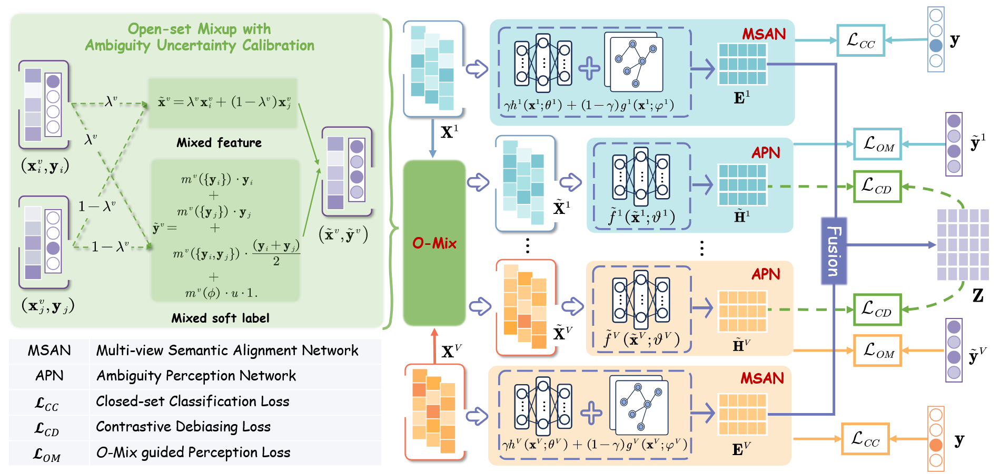

<h2 align="center"> <a href="https://dl.acm.org/doi/abs/10.1145/3746027.3755033">Enhancing Multi-view Open-set Learning via Ambiguity Uncertainty Calibration and View-wise Debiasing</a></h2>

<div align="center">

**Zihan Fang<sup>1</sup>, Zhiyong Xu<sup>1</sup>, Lan Du<sup>2</sup>, Shide Du<sup>1</sup>, Zhiling Cai<sup>3</sup>, Shiping Wang<sup>1</sup>**

<sup>1</sup>Fuzhou University, Fuzhou 350108, China<br>
<sup>2</sup>Monash University  Melbourne, Australia<br>
<sup>3</sup>Fujian Agriculture and Forestry  University  Fuzhou, China<br>
</div>

## Abstract
Existing multi-view learning models struggle in open-set scenarios  due to their implicit assumption of class completeness. Moreover,  static view-induced biases, which arise from spurious view-label  associations formed during training, further degrade their ability  to recognize unknown categories. In this paper, we propose a multiview open-set learning framework via ambiguity uncertainty calibration and view-wise debiasing. To simulate ambiguous samples,  we design O-Mix, a novel synthesis strategy to generate virtual samples with calibrated open-set ambiguity uncertainty. These samples  are further processed by an auxiliary ambiguity perception network  that captures atypical patterns for improved open-set adaptation.  Furthermore, we incorporate an HSIC-based contrastive debiasing  module that enforces independence between view-specific ambiguous and view-consistent representations, encouraging the model  to learn generalizable features. Extensive experiments on diverse  multi-view benchmarks demonstrate that the proposed framework  consistently enhances unknown-class recognition while preserving  strong closed-set performance.
## Model Architecture

<div align="center">
  
</div>


### Datasets Preparation
- For all datasets, please obtain them from the following links: <https://drive.google.com/drive/folders/1Jh4IHkpoLcFe6slS_-jXZ7uFqYIaNJ-1>;

| Dataset       | # Samples | # Feature Dimensions              | # Classes | Types              |
|---------------|-----------|-----------------------------------|-----------|--------------------|
| BBCNews       | 685       | 4,659 / 4,633 / 4,665             | 5         | Text Documents     |
| Caltech20    | 2,386     | 48 / 40 / 254 / 1,984 / 512 / 928 | 20        | Object Recognition |
| Hdigit        | 10,000    | 784 / 256                         | 10        | Digit Images       |
| Iaprtc12     | 7,855     | 100 / 100                         | 6         | Image–Text Pairs   |
| NUSWIDE-OBJ   | 30,000    | 65 / 226 / 145 / 74 / 129         | 31        | Object Recognition |
| VGGFace2     | 34,027    | 944 / 576 / 512 / 640 / 50        | 50        | Face Images        |


- Download datasets from the provided links.
- Place the datasets in the `/data` directory:
 /data/


### Usage 
To run the training MOCD, navigate to the script's directory and execute the following command in the terminal:
```
python train_MOCD.py --dataset <DATASET_NAME> 

```


## Citation
If you find our work or dataset useful, please consider citing our work:
```
@inproceedings{hituner,
  title={Enhancing Multi-view Open-set Learning via Ambiguity Uncertainty Calibration and View-wise Debiasing},
  author={Zihan Fang, Zhiyong Xu, Lan Du, Shide Du, Zhiling Cai, Shiping Wang},
  booktitle={Proceedings of the 33rd ACM International Conference on Multimedia},
pages = {1220–1228},
numpages = {9},
  year={2025}
}
```
